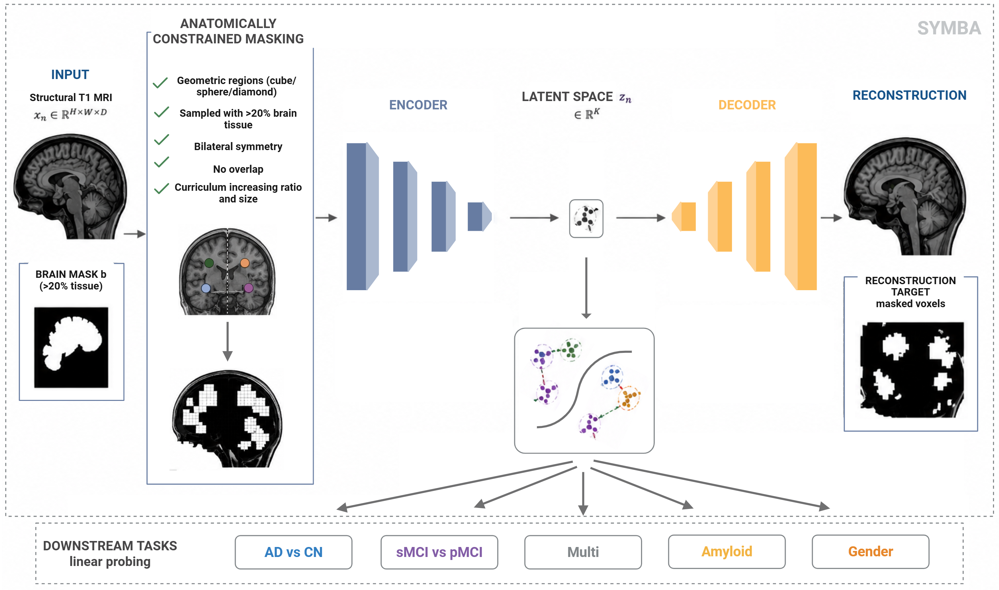

# SYMBA: Systematic Morphometric Brain Autoencoding for Representation Learning in Neurodegenerative Diseases

Official PyTorch implementation of **SYMBA** (SYstematic Morphometric Brain Autoencoding), a self-supervised pretraining framework specifically engineered for 3D structural brain MRI.

---

## Overview



Supervised deep learning models in neuroimaging frequently struggle with scanner-induced distribution shifts and limited annotations. Traditional Self-Supervised Learning (SSL) techniques inherited from natural images rely on voxel-wise losses (like MSE) and fixed cubic patch masking that fail to reflect the spatially correlated and complex hierarchical organization of brain anatomy.

**SYMBA** addresses these constraints by embedding neuroanatomical inductive biases directly into a generative pretext task using three core components:
1. **Anatomically Constrained Masking**: Erases diverse geometric structures (cubes, spheres, diamonds) solely inside valid brain tissue support boundaries (>20% soft tissue) while maintaining bilateral symmetry across the sagittal plane.
2. **Progressive Masking Curriculum**: Dynamically accelerates masking complexity throughout pretraining by scaling the target masking ratio and structural patch configurations over time. 
3. **Region-Targeted MS-SSIM Loss**: Discards trivial unmasked/background tracking and measures structural, luminance, and contrast variations strictly over occluded regions using Multi-Scale Structural Similarity.

---

[](https://opensource.org/licenses/MIT)
[](https://pytorch.org)

## 📂 Repository Structure

```text
├── data/                                # Data preprocessing and cohort configurations
│   └── dataset_tensor.py                # Custom code to get the tensor dataset 
├── scripts/                             # Source code for core architecture
│   ├── low_data_regime/
│   │   ├── linear_probing.py            # Linear probing script for the low_data_regime
│   │   └── scratch.py                   # End-to-end supervised training script for the low_data_regime
│   ├── evaluation_ADNI.py               # Downstream task frozen linear probing script
│   └── train.py                         # Main self-supervised curriculum training entry point
├── environment_SYMBA_msssim.yml         # Anaconda configuration environment file
├── requirements_SYMBA_msssim.txt        # Environment requirements
└── README.md


